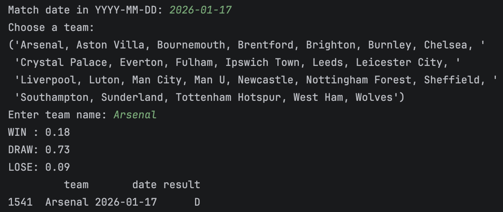
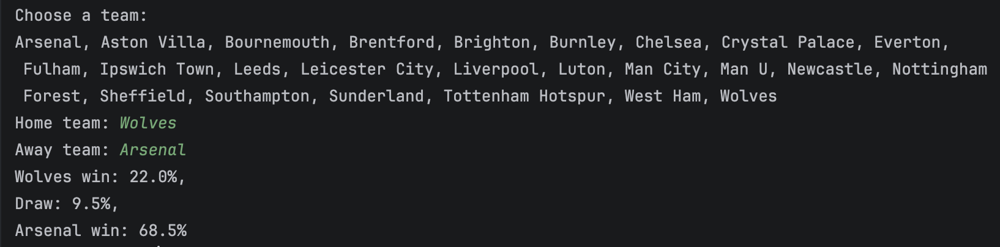
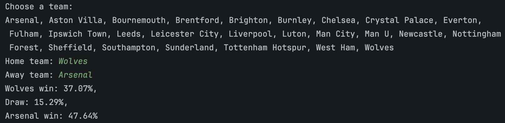
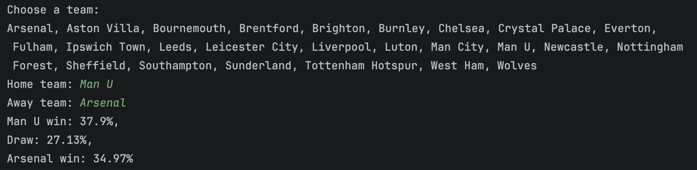

# EPL match prediction models

This project builds machine learning models to predict the probability of win, draw, or loss for Premier League matches.

It includes:
- Single-team model: estimates how strong a team is likely to perform
- Dual-team model: predicts match outcome between two teams (home vs away)

## Model development overview

1. `tutorial.py` (Based on [this tutorial](https://www.youtube.com/watch?v=0irmDBWLrco))
   1. Get data on EPL matches
   2. Clean the data to get it ready for machine learning
   3. Created initial ML model with a few predictors and target
   4. Trained RandomForest model to operate on a set of predictors
   5. Computed a precision score
   6. Improved accuracy by generating more predictors & retraining the model using the averages
   7. Improved precision by looking at both sides of the match (home/away)

2. `single_team_predictor.py`:
   - Predicts win/draw/loss probabilities for a single team
   - Allows user to input a match date
   - Ensures predictions only use past data
   - Actual match result is printed afterward to check for accuracy
   

3. `match_predictor.py`:
   - Predicts win/draw/loss probabilities for two teams (home vs away)
   - Uses team strength features for both sides
   - Allows user to input home and away teams
   - Computes probabilities based on comparative team performance
   
   

4. `match_predictor_xgboost.py`:
   - Predicts win/draw/loss probabilities for two teams (home vs away)
   - Improved dual-team model using XGBoost
   - Incorporates Elo-based team strength ratings
   - Allows user to input home and away teams
   - Computes probabilities based on comparative team performance
   
   

## Notes
- Models are trained on historical EPL match data (past 3 seasons)
- Time-based split is used to prevent data leakage
- Features include rolling averages, team strength, and Elo ratings