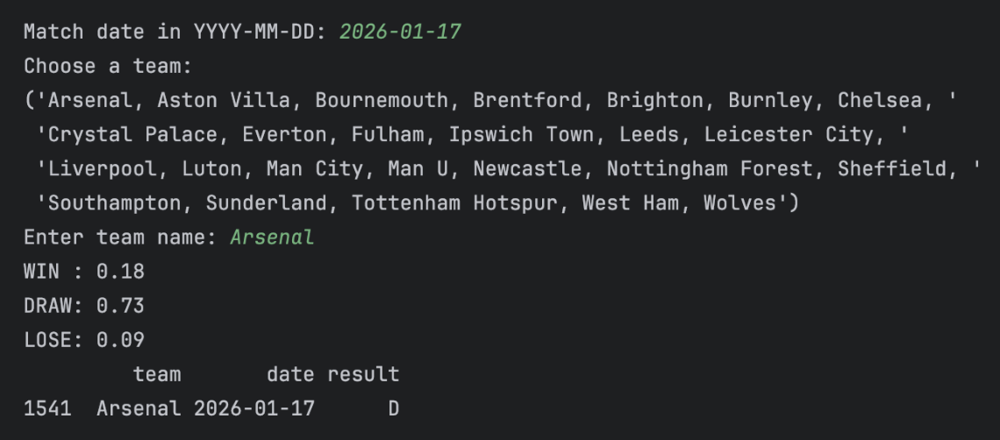
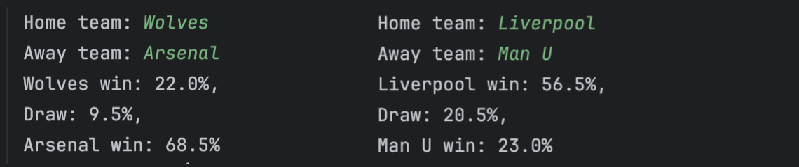
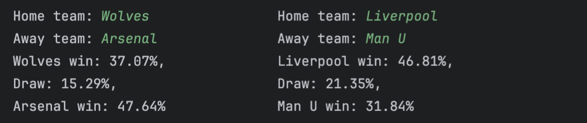
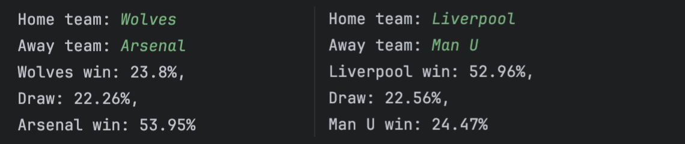
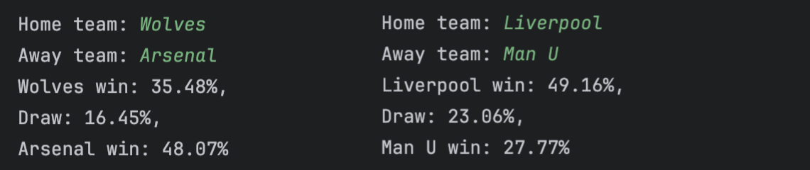

# EPL match prediction models

This project builds machine learning models to predict the probability of win, draw, or loss for Premier League matches.

It includes:
- Single-team model: estimates how strong a team is likely to perform
- Dual-team model: predicts match outcome between home and away teams

## Model development overview

1. `tutorial.py` (Based on [this tutorial](https://www.youtube.com/watch?v=0irmDBWLrco))
   1. Get data on EPL matches
   2. Clean the data to get it ready for machine learning
   3. Created initial ML model with a few predictors and target
   4. Trained RandomForest model to operate on a set of predictors
   5. Computed a precision score
   6. Improved accuracy by generating more predictors & retraining the model using the averages
   7. Improved precision by looking at both sides of the match (home/away)

2. `single_team_predictor.py`:
   - Implements a baseline RandomForest model using single-team features to estimate match win/draw/loss probabilities
   - Allows user to input a match date and team name
   - Ensures predictions only use past data
   - Actual match result is printed afterward to check for accuracy
   

3. `match_predictor.py`:
   - Implements a RandomForest model to predict win/draw/loss probabilities for two teams (home vs away)
   - Uses team strength features for both sides
   - Allows user to input home and away teams
   - Computes probabilities based on comparative team performance
   - Accuracy: ~0.42
   

4. `match_predictor_xgboost.py`:
   - Implements an XGBoost model to predict win/draw/loss
   - Incorporates Elo-based team strength ratings
   - Accuracy (with calibration): ~0.47
   
   
5. `match_predictor_catboost.py`:
   - Implements a CatBoost model
   - Builds on the same feature engineering pipeline as the XGBoost version, with added features (`goals_diff` and `shots_diff`)
   - Accuracy (with calibration): ~0.497
   
   
6. `match_predictor_lightgbm.py`:
   - Implements a LightGBM model
   - Builds on the same feature engineering pipeline as the XGBoost version
   - Accuracy (with calibration): ~0.48
   

## Notes
- Models are trained on historical EPL match data (past 3 seasons)
- Time-based split is used to prevent data leakage
- Features include rolling averages, Elo ratings, and derived team strength metrics